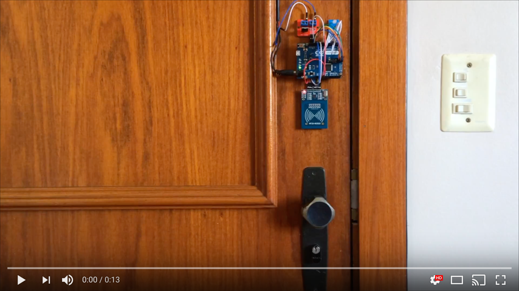

# Sesame

Access control project for my home.

[](https://www.youtube.com/watch?v=wosOB2mCduo)

## Components

* Arduino Leonardo
* MFRC522 based RFID module
* Solid-state relay module
* Electric strike
* RGB LED module

## Flow

```
                          ╔═══════════╗
                          ║ CARD READ ║
                          ╚═════╤═════╝
                         ╭──────┴──────╮
                   ✕ ╭───┤ MASTER CARD ├───╮ ✓
                     │   ╰─────────────╯   │
                 ╭───┴───╮             ╭───┴───╮
                 │ KNOWN │             │ FLIP  │
        ✕ ╭──────┤ CARD? ├──────╮ ✓    │ ADMIN │
          │      ╰───────╯      │      │ MODE  │
      ╭───┴───╮             ╭───┴───╮  ╰───────╯
      │ ADMIN │             │ ADMIN │
  ✕ ╭─┤ MODE? ├─╮ ✓     ✕ ╭─┤ MODE? ├─╮ ✓
    │ ╰───────╯ │         │ ╰───────╯ │
╭───┴────╮ ╭────┴──╮  ╭───┴────╮ ╭────┴───╮
│   DENY │ │ STORE │  │  ALLOW │ │ REMOVE │
│ ACCESS │ │ CARD  │  │ ACCESS │ │ CARD   │
╰────────╯ ╰───────╯  ╰────────╯ ╰────────╯
```
